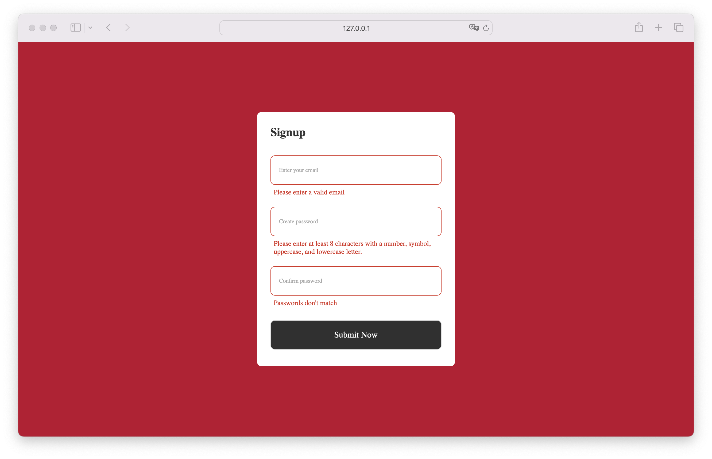
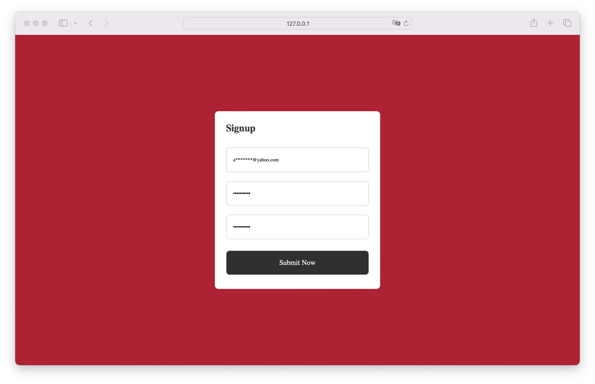
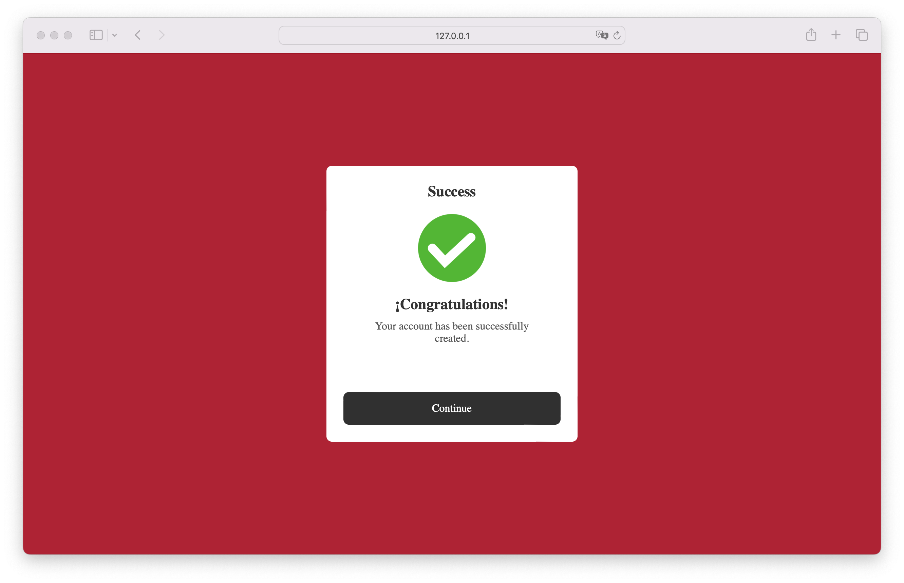

# Basic Sign Up

**Basic Sign Up** is a simple and elegant registration form with three input fields: one for the email address and two for the password (with confirmation). Upon submission, the user is redirected to a success page. Ideal for web applications that need to quickly register users, with password confirmation for added accuracy. Designed for developers, students, and small businesses seeking an easy and effective user registration solution.

## Screenshots

## Tech Stack

**Client:** HTML, CSS, JavaScript

## Prerequisites

- **Visual Studio Code (VSCode)**: You can download it from [Visual Studio Code](https://code.visualstudio.com/).

## Installation Steps

### Download the project:

1. Download the project from the repository or directly as a ZIP file.

### Open the project in Visual Studio Code:

1. Unzip the ZIP file (if you downloaded the project as a ZIP).
2. Open Visual Studio Code.
3. Select `File` > `Open Folder` and navigate to the downloaded project folder.

### Run the application:

1. If you're only using HTML, CSS, and JavaScript, simply open the `index.html` file in your preferred web browser.
2. Alternatively, you can use the Live Server extension in VSCode to run the application locally:
   - Install the **Live Server** extension from the VSCode marketplace.
   - Right-click the `index.html` file and select `Open with Live Server`.

That's it! You should now be able to see and use the **Basic Sign Up** form in your browser.

## Author

- [@jorgedoiany](https://github.com/jorgedoiany)
